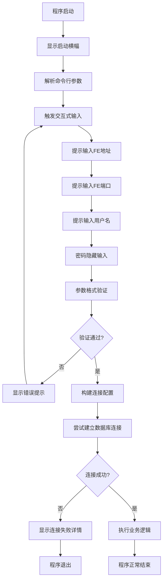

# StarRocks 连接方式重构设计

## 背景与目标

### 当前现状
项目当前采用硬编码方式管理StarRocks集群连接信息，具体表现为：
- 连接信息存储在MySQL数据库的配置表中（chengken.starrocks_information_connections）
- MySQL连接凭证硬编码在 ConnectMySQL.go 文件中（用户名、密码、主机地址）
- 程序启动时自动从MySQL加载StarRocks集群配置到全局变量 util.MetaLink
- 通过 -s 参数指定APP名称来选择对应的StarRocks集群配置

### 存在问题
- 敏感信息（MySQL密码）硬编码在代码中，存在安全风险
- 部署环境变更时需要重新编译代码
- 缺乏灵活性，无法快速切换或测试不同集群
- 不符合现代应用配置管理最佳实践

### 重构目标
将连接方式改造为命令行交互式输入模式，实现：
- 运行时动态获取连接参数，移除硬编码配置
- 提升安全性，特别是密码输入的隐私保护
- 增强灵活性，支持快速切换测试环境
- 简化部署流程，一个二进制文件适配多环境

## 需求分析

### 功能需求

#### 交互式参数输入
程序启动后，依次提示用户输入以下StarRocks连接参数：

| 参数名称 | 英文标识 | 是否必填 | 默认值 | 说明 |
|---------|---------|---------|--------|------|
| FE主机地址 | feHost | 是 | localhost | StarRocks FE节点的IP地址或域名 |
| FE端口 | fePort | 是 | 9030 | StarRocks FE节点的MySQL协议端口 |
| 用户名 | username | 否 | root | 数据库用户名，支持空用户名 |
| 密码 | password | 否 | (空) | 数据库密码，支持空密码 |

#### 密码安全输入
- 密码输入过程中不得在终端显示明文字符
- 输入时光标位置保持不变或显示占位符（如星号）
- 提供类似SSH登录的用户体验

#### 连接参数验证
- 端口号必须为有效数字范围（1-65535）
- 主机地址格式校验（IP地址或有效域名）
- 输入完成后立即尝试建立连接并验证有效性

### 非功能需求

#### 向后兼容性
- 保持现有业务逻辑不变
- 不影响其他模块对连接功能的调用方式
- 现有命令行参数（-t、-b、-s等）继续有效

#### 用户体验
- 提示信息清晰易懂，支持中文
- 输入错误时提供明确的错误提示
- 支持输入默认值的快速确认

#### 可测试性
- 支持测试环境的快速连接（空用户名、空密码）
- 连接失败时提供详细的错误诊断信息

## 架构设计

### 模块职责调整

#### 新增模块：交互式输入模块
负责命令行交互式参数获取

**职责范围：**
- 展示用户友好的输入提示
- 采集用户输入的连接参数
- 实现密码隐藏输入功能
- 进行基础参数格式验证

**输出内容：**
- 封装完整的StarRocks连接配置结构体

#### 修改模块：连接管理模块
调整 conn 包中的连接建立逻辑

**调整内容：**
- 移除对 util.MetaLink 全局配置的依赖
- 接收交互式输入模块传递的连接参数
- 保持GORM连接建立逻辑不变

#### 移除模块：MySQL配置加载
移除对外部MySQL数据库的配置依赖

**移除内容：**
- ConnectMySQL 函数及其调用
- init/init.go 中的配置加载逻辑
- util.MetaLink 全局变量

### 数据流设计



### 核心流程设计

#### 参数输入流程

**流程步骤：**

1. 显示欢迎信息和输入指引
2. 逐项提示并采集连接参数
   - 每个参数显示默认值提示
   - 用户直接回车则使用默认值
   - 密码字段调用特殊输入函数
3. 汇总显示用户输入的配置（密码脱敏显示）
4. 请求用户确认或重新输入

**交互示例文本：**

```
========================================
StarRocks 集群连接配置
========================================

请输入FE地址 [默认: localhost]: 
请输入FE端口 [默认: 9030]: 
请输入用户名 [默认: root，直接回车使用默认]: 
请输入密码（输入时不显示）: 

========================================
配置确认
========================================
FE地址: localhost
FE端口: 9030
用户名: root
密码: ******

确认连接配置？(y/n): 
```

#### 密码隐藏输入实现策略

**技术方案：**
采用 golang.org/x/term 标准库实现终端原始模式输入

**实现要点：**
- 切换终端到原始模式，禁用回显
- 逐字符读取用户输入
- 遇到回车符时结束输入
- 支持退格键删除字符
- 输入完成后恢复终端正常模式

**异常处理：**
- 非TTY环境下降级为普通输入并警告
- 用户中断（Ctrl+C）时优雅退出
- 终端状态恢复失败时记录日志

#### 连接验证流程

**验证策略：**

1. 参数格式验证
   - 端口号范围检查（1-65535）
   - IP地址格式验证或域名合法性检查
   
2. 连接可用性验证
   - 构建DSN连接串
   - 尝试建立GORM数据库连接
   - 执行简单查询验证权限（SELECT VERSION()）
   
3. 连接失败处理
   - 识别常见错误类型（网络不可达、认证失败、权限不足）
   - 提供具体的错误提示和建议
   - 允许用户重新输入或退出

**错误提示映射表：**

| 错误类型 | 错误特征 | 用户提示 |
|---------|---------|---------|
| 网络连接失败 | connection refused | 无法连接到FE地址，请检查主机地址和端口是否正确，以及网络是否可达 |
| 认证失败 | access denied | 用户名或密码错误，请重新输入 |
| 权限不足 | permission denied | 用户权限不足，请使用具有相应权限的账户 |
| 端口错误 | invalid port | 端口号必须在1-65535范围内 |

### 代码结构调整

#### 文件变更清单

**新增文件：**

| 文件路径 | 职责说明 |
|---------|---------|
| util/interactive.go | 实现交互式输入逻辑 |
| util/validator.go | 实现连接参数验证逻辑 |

**修改文件：**

| 文件路径 | 修改内容 |
|---------|---------|
| conn/ConnectStarRocks.go | 调整函数签名，接收显式参数而非全局变量 |
| util/def.go | 移除MetaLink全局变量，调整SrAvgs结构体用途 |
| main.go | 集成交互式输入流程 |
| util/conf.go | 移除-s参数的必填校验 |

**删除文件：**

| 文件路径 | 删除理由 |
|---------|---------|
| conn/ConnectMySQL.go | 不再需要连接外部MySQL配置库 |
| init/init.go | 不再需要启动时加载配置 |

#### 关键函数设计

**交互式输入函数：**

函数名称：CollectConnectionParams

职责：采集用户输入的所有连接参数

输入参数：无

返回值：
- SrAvgs 连接配置结构体
- error 错误信息

核心逻辑：
- 循环提示用户输入各项参数
- 对密码字段调用隐藏输入函数
- 提供默认值和回车快捷确认
- 汇总并请求用户确认配置

**密码隐藏输入函数：**

函数名称：ReadPassword

职责：安全采集密码输入而不显示明文

输入参数：
- prompt 提示文本

返回值：
- string 密码明文
- error 错误信息

核心逻辑：
- 检测是否为TTY终端
- 切换终端到原始模式
- 逐字符读取并缓存
- 支持退格删除
- 恢复终端模式后返回

**参数验证函数：**

函数名称：ValidateConnectionParams

职责：验证连接参数的格式和有效性

输入参数：
- cfg SrAvgs 连接配置

返回值：
- error 验证失败的错误信息

验证规则：
- 主机地址不为空
- 端口在1-65535范围内
- 用户名允许为空
- 密码允许为空

**连接测试函数：**

函数名称：TestConnection

职责：测试连接配置是否可用

输入参数：
- cfg SrAvgs 连接配置

返回值：
- error 连接失败的错误信息

测试步骤：
- 构建DSN连接字符串
- 调用GORM建立连接
- 执行简单查询验证
- 关闭测试连接

#### 调整后的StarRocks连接函数签名

**原函数签名：**
```
func StarRocks(app string) (*gorm.DB, error)
```

**新函数签名：**
```
func StarRocks(cfg SrAvgs) (*gorm.DB, error)
```

**参数变更说明：**
- 移除 app 参数（不再需要从配置表中查找）
- 直接接收 SrAvgs 连接配置结构体
- 内部逻辑保持不变，仅替换参数来源

## 测试验证方案

### 测试环境准备

#### Docker环境搭建

**StarRocks容器部署：**
- 使用官方StarRocks Docker镜像
- 容器端口映射：9030（FE端口）映射到宿主机9030
- 配置root用户免密登录（匹配测试要求）

**启动验证命令参考：**
- 检查容器运行状态
- 使用MySQL客户端测试连接：主机localhost、端口9030、用户root、密码为空
- 确认可以执行基本查询操作

### 功能测试用例

#### 测试用例1：标准连接测试

**测试目标：** 验证标准配置下的连接成功

**测试步骤：**
1. 启动编译后的二进制文件
2. 输入FE地址：localhost
3. 输入FE端口：9030
4. 输入用户名：root（或直接回车）
5. 输入密码：直接回车（空密码）
6. 确认配置

**预期结果：**
- 程序成功建立StarRocks连接
- 能够执行后续业务逻辑
- 无错误或警告信息

#### 测试用例2：密码隐藏验证

**测试目标：** 验证密码输入时不显示明文

**测试步骤：**
1. 启动程序并到达密码输入提示
2. 在密码输入框输入任意字符
3. 观察终端显示

**预期结果：**
- 输入密码时终端不显示明文字符
- 光标位置不变或显示固定占位符

#### 测试用例3：空用户名测试

**测试目标：** 验证空用户名的支持

**测试步骤：**
1. 启动程序
2. 其他参数正常输入
3. 用户名提示时直接回车（不输入）
4. 完成配置

**预期结果：**
- 程序接受空用户名
- 使用空字符串作为用户名建立连接
- 连接成功（假设StarRocks配置允许）

#### 测试用例4：参数验证测试

**测试目标：** 验证非法参数的拦截

**测试数据：**

| 测试场景 | 输入值 | 预期行为 |
|---------|--------|---------|
| 端口号超出范围 | 99999 | 提示端口号必须在1-65535范围内，要求重新输入 |
| 端口号非数字 | abc | 提示端口号必须为有效数字，要求重新输入 |
| 主机地址为空 | 直接回车且无默认值 | 提示主机地址不能为空，要求重新输入 |

#### 测试用例5：连接失败处理

**测试目标：** 验证连接失败时的错误处理

**测试场景：**

| 场景 | 构造方法 | 预期提示 |
|------|---------|---------|
| 无法连接 | 输入错误的主机地址 | 显示网络连接失败提示，建议检查地址和网络 |
| 认证失败 | 输入错误的密码 | 显示用户名或密码错误提示 |
| 端口错误 | 输入错误的端口号 | 显示无法连接提示 |

#### 测试用例6：业务功能兼容性

**测试目标：** 验证重构后业务功能正常

**测试步骤：**
1. 成功连接StarRocks后
2. 执行原有的命令行参数操作（如-t指定表、-b指定分桶数等）
3. 验证业务逻辑正常执行

**预期结果：**
- 所有原有业务功能不受影响
- 表操作、分桶调整等功能正常

### 集成测试

#### 端到端流程测试

**测试流程：**
1. 从编译二进制开始
2. 在干净环境中执行程序
3. 完成交互式输入
4. 执行一次完整的业务操作
5. 验证结果正确性

**验证检查点：**
- 编译无警告和错误
- 交互式输入流畅无卡顿
- 连接建立成功
- 业务逻辑执行正确
- 程序优雅退出

### 回归测试

**测试范围：**
- 原有所有命令行参数仍然有效
- 日志输出格式未改变
- 错误处理机制保持一致
- 性能无明显下降

## 风险评估与应对

### 技术风险

#### 风险1：终端兼容性问题

**风险描述：**
不同操作系统或终端模拟器可能对原始模式支持不同，导致密码隐藏功能失效

**影响范围：** 中等

**应对措施：**
- 在Windows、Linux、macOS三个平台分别测试
- 检测TTY环境，非TTY时降级为普通输入并警告用户
- 提供环境变量绕过选项（用于自动化脚本）

#### 风险2：向后兼容性破坏

**风险描述：**
移除全局配置可能影响其他模块的隐式依赖

**影响范围：** 高

**应对措施：**
- 详细分析所有模块对 util.MetaLink 的引用
- 逐一调整调用方式，传递显式参数
- 编写单元测试覆盖所有调整的函数

#### 风险3：输入中断处理

**风险描述：**
用户在交互输入过程中按Ctrl+C可能导致终端状态异常

**影响范围：** 低

**应对措施：**
- 注册信号处理器捕获中断信号
- 在退出前恢复终端正常模式
- 清理已分配的资源

### 业务风险

#### 风险4：用户体验下降

**风险描述：**
每次运行都需要手动输入参数，可能降低运维效率

**影响范围：** 中等

**应对措施：**
- 提供合理的默认值减少输入量
- 在文档中说明常见场景的快捷输入方法
- 未来可扩展支持配置文件或环境变量输入

#### 风险5：生产环境迁移阻力

**风险描述：**
现有依赖MySQL配置的生产环境可能无法快速切换

**影响范围：** 中等

**应对措施：**
- 提供详细的迁移指南
- 保留过渡期的双模式支持（通过编译选项）
- 提供配置导出工具协助迁移

### 安全风险

#### 风险6：密码泄露风险

**风险描述：**
即使终端不显示，密码仍以明文形式在内存中传递

**影响范围：** 低

**应对措施：**
- 使用完密码后立即清零内存
- 避免在日志中记录密码相关信息
- 提示用户注意终端会话安全

## 实施计划

### 开发阶段

#### 阶段1：准备工作
- 搭建本地StarRocks Docker测试环境
- 创建代码分支进行重构开发
- 备份当前可运行版本

#### 阶段2：核心功能开发
- 开发交互式输入模块（util/interactive.go）
- 开发参数验证模块（util/validator.go）
- 调整连接管理模块（conn/ConnectStarRocks.go）

#### 阶段3：集成与清理
- 修改主程序集成交互式流程（main.go）
- 移除废弃的配置加载代码
- 更新命令行参数处理逻辑

#### 阶段4：测试验证
- 执行所有功能测试用例
- 进行多平台兼容性测试
- 执行回归测试确保业务功能正常

### 交付标准

**功能完整性：**
- 所有交互式输入功能正常
- 密码隐藏功能在主流终端有效
- 参数验证逻辑完备
- 连接建立成功率100%（配置正确时）

**质量标准：**
- 代码通过静态检查（go vet、golint）
- 单元测试覆盖率达到70%以上
- 无已知严重或高危缺陷

**测试通过标准：**
- 在Docker环境中使用测试凭证（localhost:9030, root, 空密码）成功连接
- 能够执行至少一个完整的业务操作
- 所有测试用例通过

**文档完整性：**
- 更新README说明新的使用方式
- 提供交互式输入的示例截图
- 编写配置迁移指南（如需要）

## 附录

### 参考技术栈

| 技术组件 | 用途 | 备注 |
|---------|------|------|
| golang.org/x/term | 终端控制与密码隐藏输入 | Go官方扩展库 |
| gorm.io/gorm | 数据库ORM连接 | 保持现有技术栈 |
| gorm.io/driver/mysql | MySQL协议驱动 | StarRocks兼容MySQL协议 |
| github.com/fatih/color | 终端彩色输出 | 保持现有UI风格 |

### StarRocks连接参数说明

**MySQL协议兼容性：**
StarRocks的FE节点提供MySQL协议兼容接口，默认监听9030端口，可使用标准MySQL客户端和驱动连接。

**必需参数：**
- Host：FE节点的主机地址
- Port：FE节点的MySQL协议端口（默认9030）
- User：数据库用户名（可为空，取决于StarRocks配置）
- Password：数据库密码（可为空，取决于StarRocks配置）

**可选参数（当前保持默认）：**
- Database：初始连接的数据库（当前固定使用information_schema）
- Charset：字符集（当前固定使用utf8mb4）
- ParseTime：时间解析选项（当前固定为true）
- Loc：时区设置（当前固定为Local）

### DSN连接字符串格式

**格式模板：**
```
{User}:{Password}@tcp({Host}:{Port})/information_schema?parseTime=true&charset=utf8mb4&loc=Local
```

**示例：**

| 场景 | DSN示例 |
|------|---------|
| 完整凭证 | user:pass@tcp(192.168.1.100:9030)/information_schema?parseTime=true&charset=utf8mb4&loc=Local |
| 空密码 | root:@tcp(localhost:9030)/information_schema?parseTime=true&charset=utf8mb4&loc=Local |
| 空用户名和密码 | :@tcp(localhost:9030)/information_schema?parseTime=true&charset=utf8mb4&loc=Local |

### 术语表

| 术语 | 说明 |
|------|------|
| FE | Frontend，StarRocks的前端节点，负责接收查询和元数据管理 |
| BE | Backend，StarRocks的后端节点，负责数据存储和查询执行 |
| DSN | Data Source Name，数据源连接字符串 |
| TTY | TeleTYpewriter，终端设备接口 |
| 原始模式 | Terminal Raw Mode，终端不处理输入的模式，用于自定义输入行为 |
| GORM | Go Object Relational Mapping，Go语言的ORM库 |
